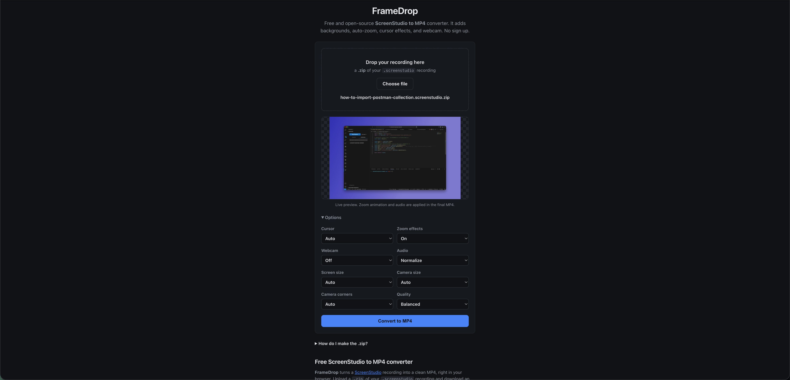

# FrameDrop: Free ScreenStudio to MP4 Converter (Open Source)

[](LICENSE)
[](requirements.txt)
[](CONTRIBUTING.md)

**FrameDrop** is a free, open-source, self-hostable web app that converts a
**ScreenStudio (`.screenstudio`) recording into an MP4**. It adds your
background, rounded window, drop shadow, auto-zoom, cursor and click ripples,
webcam bubble, and normalized audio. No account, no watermark, no tracking.

> Upload a `.zip` of your `.screenstudio` recording and download a rendered MP4.



- **One page, no build step.** Plain HTML/CSS/JS frontend, FastAPI backend.
- **Faithful render.** Reproduces the editor's composition and zoom timing.
- **Privacy-friendly.** Uploads are processed server-side and deleted after conversion.
- **Open source (MIT).**

## Table of contents

- [Requirements](#requirements)
- [Quick start (clone & install)](#quick-start-clone--install)
- [Run with Docker](#run-with-docker)
- [Configuration](#configuration)
- [How a user makes the upload](#how-a-user-makes-the-upload)
- [API](#api)
- [How it works](#how-it-works)
- [Notes and limits](#notes-and-limits)
- [Contributing](#contributing)
- [License](#license)

## Requirements

- Python 3.10+
- `ffmpeg` and `ffprobe` on your `PATH`
  - macOS: `brew install ffmpeg`
  - Debian/Ubuntu: `apt install ffmpeg`

### Screen Studio compatibility

FrameDrop reads the `.screenstudio` bundle format produced by **Screen Studio 3.x**
(tested against the current **3.7.x** release). Newer 3.x releases share the same
bundle format and should work; a future major version may not.

Screen Studio is macOS-only. The official site always serves the latest build, so
the version you download may be newer than the one tested above.

## Quick start (clone & install)

```bash
# 1. Clone the repository (replace with your fork's URL if you forked it)
git clone https://github.com/saurowankhade/FrameDrop.git
cd FrameDrop

# 2. Create and activate a virtual environment
python3 -m venv .venv
source .venv/bin/activate          # Windows: .venv\Scripts\activate

# 3. Install dependencies
pip install -r requirements.txt

# 4. Configure environment (optional; sensible defaults are built in)
cp .env.example .env

# 5. Run it
python run.py
# open http://localhost:8000
```

Variables in `.env` are loaded automatically. See [Configuration](#configuration).

## Run with Docker

```bash
docker build -t framedrop .
docker run --rm -p 8000:8000 framedrop
# open http://localhost:8000
```

The image installs `ffmpeg` for you.

## Configuration

Copy `.env.example` to `.env` and adjust. All variables are optional; defaults
are shown below.

| Env var                 | Default        | Meaning                                                     |
| ------------------------ | -------------- | ------------------------------------------------------------ |
| `FRAMEDROP_HOST`         | `127.0.0.1`    | Bind address (`0.0.0.0` to expose / in Docker).              |
| `FRAMEDROP_PORT`         | `8000`         | Port to listen on.                                           |
| `FRAMEDROP_MAX_UPLOAD`   | `4294967296` (4 GiB) | Max upload size in bytes.                              |
| `FRAMEDROP_MAX_WORKERS`  | `2`            | Concurrent conversions. Scale to your CPU cores.              |

> Legacy `RECAST_*` names are still honoured as a fallback.

## How a user makes the upload

A recording is a folder that macOS shows as a single file, so it must be zipped
before a browser can upload it:

1. Find the recording in Finder (it ends in `.screenstudio`).
2. Right-click it → **Compress**.
3. Drop the resulting `.zip` onto the page.

## API

| Method | Path                      | Purpose                                       |
| ------ | ------------------------- | ---------------------------------------------- |
| POST   | `/api/upload`             | Upload a `.zip`, hold it for preview → `{ id }` |
| GET    | `/api/preview/{id}`       | Render one preview frame for the current options |
| POST   | `/api/convert`            | Start converting an uploaded recording → `{ id }` |
| GET    | `/api/jobs/{id}`          | Poll job status and progress                  |
| GET    | `/api/jobs/{id}/download` | Download the finished MP4                     |
| GET    | `/api/health`             | Dependency check                              |

## How it works

```
upload .zip → extract → prepare (assets + filtergraph)
            → cursor overlay → render video → build audio → mux → MP4
```

Rendering happens with `ffmpeg`; composition assets (masks, shadow, background)
are drawn with Pillow. Uploaded archives and intermediates are deleted after a
job finishes; the MP4 is kept for one hour and then swept.

## Notes and limits

- The first scene of a project is rendered. Speed ramps (`timeScale ≠ 1`) are
  treated as `1.0`.
- macOS "system wallpaper" backgrounds aren't shipped inside a recording, so the
  project gradient/color is used instead.
- Large recordings mean large uploads. For a public deployment, put a size limit
  and a reverse proxy in front, and scale `FRAMEDROP_MAX_WORKERS` to your CPU.

## Contributing

Bug reports, feature ideas, and PRs are welcome. See
[CONTRIBUTING.md](CONTRIBUTING.md) for how to get set up, and
[CODE_OF_CONDUCT.md](CODE_OF_CONDUCT.md) for project norms. Found a security
issue? Please follow [SECURITY.md](SECURITY.md) instead of opening a public
issue.

## License

MIT. See [LICENSE](LICENSE).
